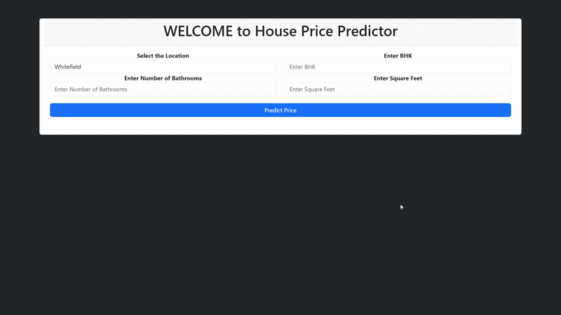

# House Price Prediction


## Demo

<p align="center">
  
</p>

<p align="center">
  <em>Real-time house price prediction using Flask and Ridge Regression</em>
</p>


## Introduction
This project is a Machine Learning web application that predicts house prices in Bangalore, India, based on user inputs such as location, number of bedrooms, number of bathrooms, and total square footage.

The project demonstrates the complete Machine Learning lifecycle, from data preprocessing and model building to deployment through a Flask web application.

The dataset used for this project was obtained from Kaggle.

---
## Live Demo

Deployed application: [Try the application here](https://house-price-prediction-kiyy.onrender.com)

```text
https://house-price-prediction-kiyy.onrender.com
```

---
## Features

- Predict house prices for Bangalore properties
- Interactive web interface for user inputs
- Machine Learning model served through a Flask backend
- Real-time predictions without requiring users to interact with Python code

---

## Machine Learning Concepts Used

- Data loading and preprocessing
- Handling missing values
- Feature engineering
- Outlier detection and removal
- Dimensionality reduction
- One-Hot Encoding for categorical variables
- Model selection
- K-Fold Cross Validation
- Model serialization using Pickle

---

## Technologies and Tools Used

### Backend
- Python
- Flask
- Scikit-learn
- Pandas
- NumPy

### Frontend
- HTML
- CSS
- JavaScript
- Bootstrap

---

## Project Workflow

### Step 1: Data Collection

- Obtained the Bangalore house price dataset from Kaggle.

### Step 2: Data Cleaning

- Removed unnecessary columns
- Handled missing values
- Corrected inconsistent data entries

### Step 3: Feature Engineering

- Converted size information into numerical format
- Created relevant features for model training

### Step 4: Dimensionality Reduction

- Reduced the number of location categories to improve model performance.

### Step 5: Outlier Detection and Removal

Used domain knowledge to remove unrealistic entries, such as:

- Houses with extremely low square footage per bedroom
- 3 BHK houses priced lower than 2 BHK houses in the same locality

Statistical techniques involving mean and standard deviation were also used.

### Step 6: Model Building

Multiple regression algorithms were trained and evaluated using K-Fold Cross Validation to identify the most suitable model for predicting Bangalore house prices.

### Step 7: Model Export

The trained model was exported using Pickle:

```text
RidgeModel.pkl
````

The cleaned dataset used by the Flask application was also saved:

```text
Cleaned_data.csv
```

### Step 8: Flask Web Application

A Flask server was developed to:

* Load the trained model
* Accept user inputs through HTTP requests
* Return predicted house prices dynamically

### Step 9: Frontend Development

An interactive user interface was built using:

* HTML
* CSS
* Bootstrap
* JavaScript (AJAX)

Users can enter:

* Location
* Number of BHKs
* Number of Bathrooms
* Total Square Footage

and receive an estimated house price instantly.

---
## Model Performance

### Model Comparison

| Model | R² Score |
|---------|----------|
| Linear Regression (No Regularization) | **0.8687** |
| Lasso Regression | 0.8565 |
| Ridge Regression | **0.8687** |

### Final Model Selection

Although Linear Regression and Ridge Regression produced very similar results, **Ridge Regression** was selected as the final model because it provides regularization, which helps reduce overfitting while maintaining predictive performance.

**Final Model:** Ridge Regression  
**Best R² Score:** **0.8687**

---

## Project Structure

```text
HousePrediction/
│
├── main.py                 # Flask application
├── RidgeModel.pkl          # Trained Ridge Regression model
├── Cleaned_data.csv        # Processed dataset
├── requirements.txt        # Python dependencies
│
├── templates/
│   └── index.html
│
├── static/
│   └── styles.css
│
└── House_Price_Prediction.ipynb    # Model training notebook
```

---

## Dataset Reference

* [Bengaluru House Price Dataset](https://www.kaggle.com/datasets/amitabhajoy/bengaluru-house-price-data)

---

## Notebook

The complete data cleaning, feature engineering, and model training process is documented in:

```text
House_Price_Prediction.ipynb
```

[Kaggle Notebook](https://www.kaggle.com/code/omkargurav216/houseprediction)

---

## Acknowledgements

[Reference](https://youtu.be/DVxkI1VmpCk?si=NS1SNtrgNN5l3aQY) : https://www.youtube.com/@campusx-official

---
## Author

**OMKAR GURAV**

- [GitHub](https://github.com/omkargurav0216-code/)
- [LinkedIn](https://linkedin.com/in/omkargurav0216/)
---